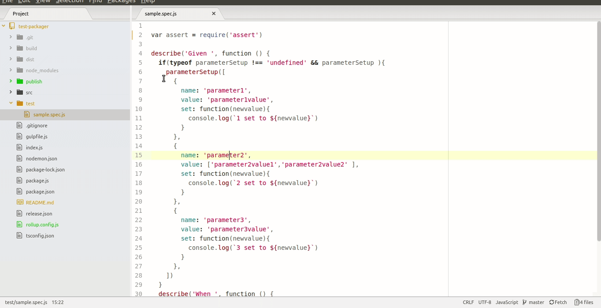

# Test Packager

This repository can be used to package up a set of mocha tests so that they exist within a self contained html.
You can send the html to a colleague and by opening up the html page they can run the tests.



## How to use

- clone the repository
- install the dependencies ```npm install```
- modify the package.js and 'require' any mocha tests that should be included into the html.
- then run ```npm start```
- The application will produce the self contained html file into the 'publish' directory.
- Open the html to verify.

## How to parameterize tests

If you can to allow the user to parameterize tests you can call the parameterSetup function in your test.
You provide a set of parameter definitions which include the 'set' callback which is invoked if the user changes the value

`
  if(typeof parameterSetup !== 'undefined' && parameterSetup ){
   parameterSetup([
      {
        name: 'parameter1',
        value: 'parameter1value',
        set: function(newvalue){
          console.log(`1 set to ${newvalue}`)
        }
      },
      {
        name: 'parameter2',
        value: ['parameter2value1','parameter2value2' ],
        set: function(newvalue){
          console.log(`2 set to ${newvalue}`)
        }
      }
    ])
  }
`

### Known Limitations

Currently the test can only be run once.  If you want to rerun the test you have to reload the html page.
